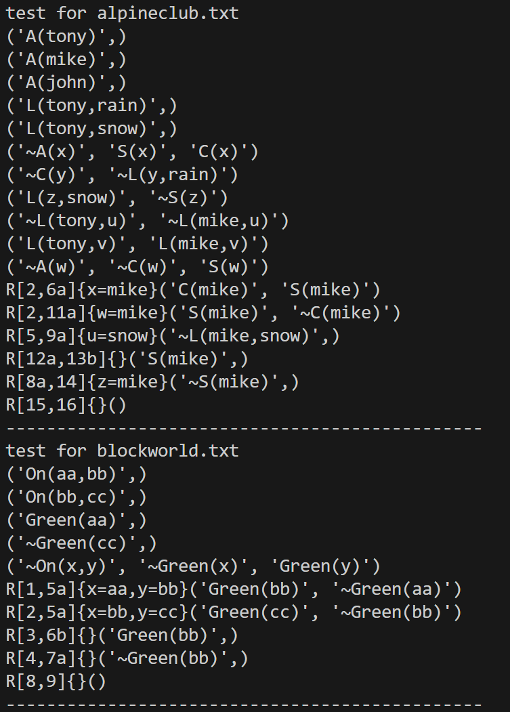

# 
归结原理自动定理证明方法

## 效果展示

## 算法原理
一阶逻辑归结算法是一种基于逻辑的自动推理技术，用于确定一组一阶逻辑子句是否一致（即可能同时为真）或不一致（即不可能同时为真）。这种算法的核心是归结原则，它是一种用于从子句集中推导出新子句的规则。归结原则的核心思想是寻找两个互补的文字（即一个是肯定的，另一个是否定的），并消除它们，从而产生一个新的子句。

本程序代码的设计分为以下几个步骤：

1、利用 Python 的读文件操作进行测试用例的读取，并将读取结果保存起来，保存的结构为 `list[tuple[str]]` 。list 中保存所有的子句，对于每一个子句，采用 `tuple[str]`的结构进行保存，元组内保存文字（谓词），结构为 str。

2、文字解析。将子句中的文字（谓词）传入函数进行解析，返回一个列表，列表中保存文字的信息，结构为 `[bool（否定词）, 谓词, 参数 1, 参数 2…]`

3、MGU 算法。对两个文字进行 MGU 算法，函数传入对文字解析得到的列表，返回 bool 值，为 True 表示可以替换，False 表示不可替换，同时对替换字典进行修改，字典中 key 保存变量，value 保存替换后的项，包括变量、常量和函数。

4、生成归结子句。应用 MGU 替换到原始子句中，生成一个新的归结子句。归结子句是通过消除互补文字对得到的，它不包含任何互补的文字。

5、循环以不断归结，直到生成空子句或不可再次归结，终止算法。

6、打印归结步骤。这里需要注意的是，在子句的归结过程中可能会产生无用的归结步骤，这时要避免对其进行打印。我采用的解决思路是，**直到归结产生空子句后才开始打印归结步骤，采取回溯的办法，如果 c 子句由 a 子句和 b 子句归结产生，将 c 子句看作二叉树的根节点，a 和 b 为左右孩子，只有 a 和 b 被打印，c 才会被打印，也就是采取二叉树的后序遍历进行递归的打印操作。**

## 代码运行
`python ./resolve.py` 

